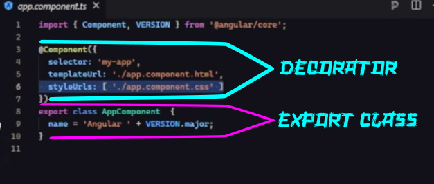
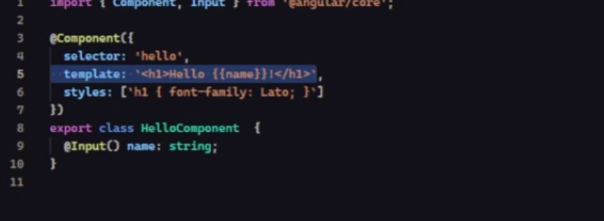

# Detalhando mais o *Component*

De acordo com a figura o código que cria o componente é basicamente composto da seguinte forma:

* ***Decorator*** => nessa parte do código , é informado para aplicação 
    * como o componente deve ser chamado *(selector)*
    * quaiis elementos HTML vão compor esse compoenente *(templateUrl)*
    * Estilo do componente *(styleUrls)*

* ***Export Class*** => essa parte serve para expor o componente para que ele possa ser utilizado em outros componentes ou partes do projeto. Nesse caso, está sendo adicionado uma propriedade chamada *name* ao Props da classe. QUando esse componente for chamado o valor da propriedade *name* vai ser passado como um input.

No caso a propriedade *name* ta sendo passado direto no template, através de um processo chamado  *HTML in-line* e após a exposição do componente, é criado o molde onde vai receber o *@Input* com o *name* e o tipo a ser recebido.

### Criação de um Componente no Angular

Sendo assim, o passo a passo para criação de um componente no Angular:
* Dentro da pasta *src* criar uma pasta chamada *components*;
* Dentro da pasta components criar uma pasta para cada componente necessário.Ex: Menu
* Ai dentro da pasta do componente Menu(exemplo), criar o arquivo que vai criar o componente em si, no caso *menu.component.ts*
    * Dentro do arquivo *.ts* a estrutura é a seguinte:
        * `import {Component} from @angular/core;` => vai importar a interface(contrato) que diz pra aplicação que esse arquivo será um componente;
        * implementar o *Decorator* que faz parte do contrato utilizado(Interface), como está na primeira figura;
        * `export class NomeComponent` => sempre expor o nome do componente no formato CamelCase
* Criar o arquivo com os elementos HTML, nesse caso, *menu.component.html*;
* CRiar o arquivo de estilização do componente , seguindo o exemplo, *menu.component.css*
* Não esquecer de apontar esses arquivos no *Decorator* do arquivo.ts criado.

* Em seguida , é extremamente importante que o componente seja registrado no arquivo de módulos da aplicação. Geralmente esse arquivo é criado no momento da criação da aplicação e vem com uma extensão *.module*.É nesse arquivo onde os componentes são registrados e ficam disponiveis para a aplicação. No caso `import {nome da Classe do component} from localarquivo;` e em seguida ao *import* , necessário declarar o component na seção *declarations* de ***@NgModule***.
