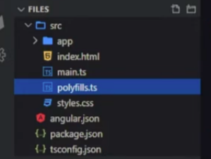
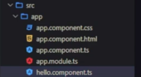

# Estrutura de um arquivo Angular

Em uma página que foi desenvolvida utilizando o framework Angular, existem boas práticas quanto à organização da estrutura do arquivo.

Basicamente, todo o código desenvolvido deve estar alocado dentro de uma pasta *"src"*. Fora dessa pasta ficarão os arquivos *.json* de configuração como o *angular.json*, *package.json* e *tsconfig.json.*

Dentro da pasta *src* são colocados os arquivos que renderizam a página. No caso de uma página muito básica, como no exemplo da figura abaixo, existe uma pasta *app* seguida de um documento HTML, uma página com a declaração dos componentes *main.ts* e um arquivo *polyfills.ts* que geralmente é utilizado para implementar métodos que precisem ser compatíveis com os navegadores atuais e por último um arquivo de estilização *styles.css*

Na estrutura dessa página , pode-se afirmar que a pasta *app* é o componente que é chamado no documento HTML. Dentro dessa pasta pode-se observar a esturura básica de um componente:
 

Bem detalhado:

* *app.component.css* => contem a estilização desse componente;
* *app.component.html* => contem a parte visual do componente. Elementos(tags HTML) que vão compor esse componente;
* *app.component.ts* => parte lógica do componente. Onde é configurado o *selector* ou apelido pelo qual esse componente vai ser chamado e templates de origem e estilo. ***É A PORTA DE ENTRADA DO COMPONENTE EM SI, OU SEJA, É A PARTE QUE VAI CRIAR O COMPONENTE*** ;
* *app.module.ts* => aqui são configurados a importação de outras bibliotecas, componentes ou módulos necessários para compor o componente;
* *hello.component.ts* => um componente que foi criado e está sendo importado pelo *app.module.ts* e adicionado no *app.component.ts* e depois renderizado no *app.component.html*

### Fluxo de montagem da aplicação(página)

Basicamente, um componente é uma função javascript que criar elementos HTML. E como tal pode ser estilizado por CSS.

Sendo assim é normal supor que essa funções devem ser importadas no código pra poder funcionar normalmente. 

Acontece que em Angular esse processo é executado através do processo chamado *Injeção de Dependências*. Quer dizer que pra um componente ter todos seus elementos funcionando é preciso apontar a origem dos arquivos que aquele componente precisa  para poder funcionar, ou seja, injetar a dependência praquele componente.

Esse processo tambem vale para a página ou aplicação angular. Após a criação dos componentes, é necessário ir até o componente principal *(geralmente app-root)* e injetar nele as dependencias dos componentes que foram criados.

Na maioria dos casos essa injeção é feita através da palavra-chave *@Import*.

E após ter sido feito esse processo, basta ir no arquivo HTML principal e fazer a injeção de dependência do componente principal, que por sua vez já está configurado com as dependências necessárias
