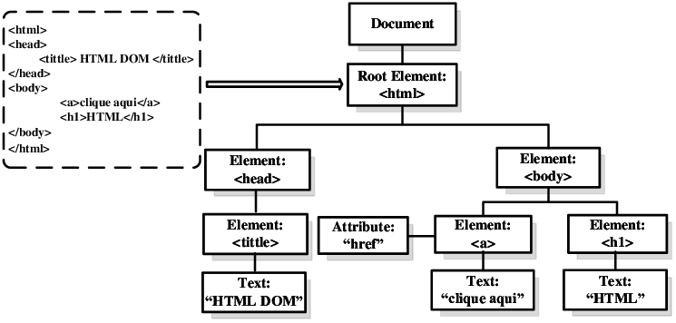
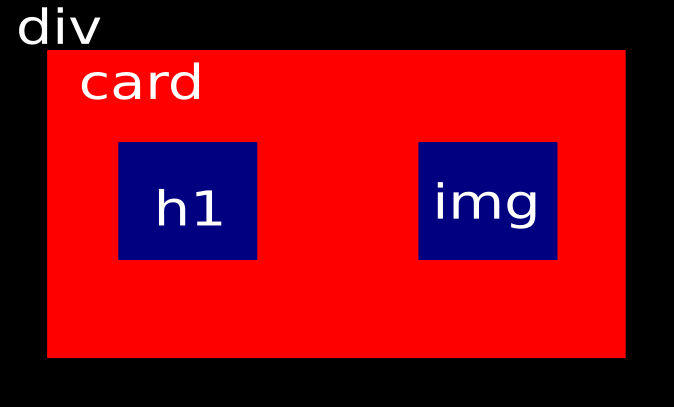

# Entendendo a DOM

* DOM => Document Object Model.

O DOM é um tipo de objeto que é retornado quando um documento HTML é processado pelo browser através de um Parsed

Quando uma pagina é criada atraves de HTML e estlizada pelo CSS, esse documento precisa ser renderizado ou seja, cada elemento do código **(tag HTML)** deve ser traduzida em uma forma que o browser entenda. 

Essa renderização transforma o código HTML em uma arvore de elementos.

Na imagem acima, o ultimo elemento sempre é considerado filho ***(child)*** do elemento anterior ***(parent)***. Isso é importante saber quando se usa referencias geralmente ao se utilizar javascript por exemplo.

Para se ter acesso à arvore de elementos, geralmente é utilizado a referencia ao objeto ***document***.

## Shadow D.O.M

Como dito acima, o D.O.M é um objeto ***document*** gerado através do processo ***parsed*** originada numa rendereização de um código HTML. 

Acontece que esse objeto DOM é controlado especificamente pelo browser , mas isso não impede que seus elementos possam ser acessados individualmente através de um código Javascript por exemplo. 

Num código pequeno até que a performance não é muito afetada, mas e quando existem vários elementos? . As vezes um elemento é gerado por um laço e as vezes esse elemento contem varios elementos filhos. 

Imagine o tamanho do código que serária gerado no html e no DOM depois.

Por isso foi criado o conceito de **Shadow DOM**. Basicamente é vc criar uma mini arvore dentro de um elemento.

Por exemplo....Uma div contem um div card e dentro da div card um elemento h1 e um elemento img

Se isso se repetisse no código com certeza , ia ficar muito verboso. Por isso, utilizando o conceito de Shadow DOM , esse elemento é criado de uma forma customizada, e quando for necessario basta apenas chamar o nome desse elemento no código. 

Isso é uma forma de encapsulamento desse código que permite tratar apenas o código relacionado com aquele elemento desejado, ou *component*.
